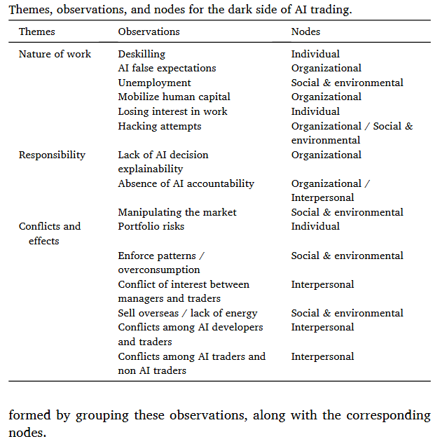

## Introdução

Este relatório tem o objetivo de apresentar uma análise crítica da seção de métodos do artigo "Uncovering the dark side of AI-based decision-making: A case study in a B2B context" [@papagiannidis2023] e foi desenvolvido para a disciplina de Métodos Qualitativos do programa de doutorado do COPPEAD/UFRJ, ministrada pela professora Dra. Ariane Roder Figueira.

O relatório está estruturado em duas seções: primeiro, uma breve análise do artigo onde serão expostos os objetivos e a metodologia utilizada pelos autores; em seguida, uma análise crítica da seção de métodos do artigo usando como referencial principal o trabalho de @estudod2021.

O artigo analisado foi publicado em 2023 na revista *Industrial Marketing Management*, periódico de alto impacto na área de marketing e gestão industrial. A revista possui fator de impacto JCR de 10.3 (2022) e está classificada como A1 no Qualis Periódicos da CAPES, recentemente atualizado para o estrato MB no novo sistema de avaliação referente ao quadriênio 2025-2028 da Área 27 (Administração Pública e de Empresas, Ciências Contábeis e Turismo [@machado]). Esta classificação destaca a relevância e o rigor científico necessários para ter uma publicação aceita nessa revista e justifica a escolha do mesmo para ser alvo desta análise crítica, seguindo o que é pedido no plano de ensino desta disciplina de métodos qualitativos, além disso o tema tem relevância para a minha pesquisa que tem como objetivo conduzir um estudo de caso dentro do contexto de governança de IA. O artigo pode ser acessado no Link: [Uncovering the dark side of AI-based decision-making: A case study in a B2B context](https://www.sciencedirect.com/science/article/pii/S0019850123001931)

## Análise do artigo

O artigo de @papagiannidis2023 investiga o lado obscuro da tomada de decisão baseada em inteligência artificial (IA) no contexto business-to-business (B2B), explorando como a implementação de sistemas de IA pode gerar consequências não intencionais e impactos negativos nas organizações. Os autores partem da premissa de que, embora a literatura predominante enfatize os benefícios da IA para a tomada de decisão empresarial, há uma lacuna no entendimento dos desafios, riscos e efeitos adversos associados à sua adoção no contexto B2B. O objetivo do estudo é identificar os aspectos negativos do uso de IA em trading, compreender como os bots de IA afetam as relações entre traders e desenvolvedores de IA, e examinar como a empresa se ajusta a esta nova realidade.

Para atingir seus objetivos, os pesquisadores adotaram uma abordagem qualitativa baseada em estudo de caso único, conduzido em uma empresa norueguesa de trading de energia que implementou sistemas de IA para apoiar decisões de compra e venda de energia. A coleta de dados envolveu quatorze entrevistas semiestruturadas com múltiplos stakeholders, incluindo gerentes de IA, traders, cientistas de dados e engenheiros de machine learning, com duração média de 45 minutos cada. Além das entrevistas, os autores utilizaram dados secundários, incluindo relatórios e documentos internos, para suplementar e validar os achados. A análise dos dados foi realizada através de codificação axial, organizando as observações em quatro níveis: individual, interpessoal, organizacional e social/ambiental.

Os resultados mostraram que as consequências negativas da implementação de IA para decisões em trading B2B podem ser agrupadas em três dimensões principais: natureza do trabalho, incluindo *deskilling* dos traders, falsas expectativas sobre IA, questões de desemprego e perda de interesse no trabalho; responsabilidade, cobrindo a falta de explicabilidade das decisões de IA, ausência de accountability clara e riscos de manipulação de mercado; e conflitos e efeitos, envolvendo riscos de portfólio, conflitos de interesse entre gestores e traders, e tensões entre desenvolvedores de IA e traders. O estudo também identificou efeitos socioeconômicos, como o impacto nas decisões de consumo de energia dos clientes. Estes achados segundo os autores contribuem para uma compreensão crítica da adoção de IA em contextos B2B, destacando a necessidade de considerar não apenas os benefícios técnicos e financeiros, mas também as implicações humanas, organizacionais e sociais destas tecnologias.

### Análise crítica da seção de métodos

A seção de métodos do artigo de @papagiannidis2023 apresenta uma estrutura metodológica que se alinha, em grande medida, com os princípios estabelecidos por @estudod2021, que é citado no embasamento da sessão de métodos. Os autores optaram por um estudo de caso único, conduzido em uma empresa norueguesa de trading de energia, justificando essa escolha com base na natureza reveladora do caso, isto é, a oportunidade de observar e analisar um fenômeno previamente inacessível à investigação científica sistemática. Conforme @estudod2021 argumenta, um caso único pode ser apropriado quando representa um teste decisivo de uma teoria bem formulada, quando constitui um caso raro ou extremo, ou quando serve a um propósito revelador. No caso em questão, o acesso privilegiado dos pesquisadores ao contexto organizacional e a possibilidade de investigar em profundidade como a IA afeta as relações entre traders e desenvolvedores justificam a escolha metodológica. Os autores também demonstraram clareza ao definir sua unidade de análise, a organização como um todo, e as subunidades incorporadas, incluindo os diferentes grupos de stakeholders, o que @estudod2021 considera primário para evitar o deslizamento insuspeitado do escopo da pesquisa.

No que concerne à coleta de dados, @papagiannidis2023 empregaram uma abordagem de triangulação que se aproxima das recomendações de @estudod2021 para o aumento da validade do constructo. Foram realizadas quatorze entrevistas semiestruturadas com diferentes stakeholders (gerentes de IA, traders, cientistas de dados e engenheiros de machine learning) com duração média de 45 minutos cada, complementadas por dados secundários incluindo relatórios e documentos internos. @estudod2021 enfatiza que o uso de múltiplas fontes de evidências é uma das três táticas para aumentar a validade do constructo em estudos de caso, permitindo o desenvolvimento de linhas convergentes de investigação. Embora os autores tenham utilizado essa estratégia de forma adequada, observa-se uma lacuna importante: não há menção explícita ao estabelecimento de um encadeamento de evidências, a segunda tática recomendada por @estudod2021, que permitiria a um observador externo seguir a derivação de qualquer evidência desde as questões iniciais da pesquisa até as conclusões finais do estudo. Além disso, os autores não especificam claramente se o rascunho do relatório foi revisado por informantes-chave, a terceira tática para validação do constructo sugerida por @estudod2021.

A análise dos dados foi conduzida através de codificação axial, organizando as observações em quatro níveis: individual, interpessoal, organizacional e social/ambiental, conforme apresentado na Tabela 2 do artigo. Esta estratégia dos autores estabelece uma estrutura analítica que relaciona os dados coletados às proposições teóricas do estudo. @estudod2021 argumenta que ligar os dados às proposições e estabelecer critérios para interpretação das descobertas são componentes importantes em estudos de caso (*so what?*), embora frequentemente menos desenvolvidos. @papagiannidis2023 parecem ter endereçado essa questão ao desenvolver uma estrutura teórica prévia sobre o "lado obscuro" da IA, baseada na literatura existente sobre *responsible AI* e nas teorias de poder organizacional de @linstead2014. No entanto, os autores poderiam ter sido mais explícitos sobre como utilizaram a técnica de adequação ao padrão, descrita por @estudod2021 como uma abordagem na qual várias partes da mesma informação podem ser relacionadas à mesma proposição teórica, o que fortaleceria a validade interna do trabalho.

{fig-align="center" width="50%"}

Quanto à questão da generalização e validade externa, @papagiannidis2023 reconhecem as limitações inerentes ao estudo de caso único, mencionando que os dados foram coletados em apenas uma organização do setor de energia na Noruega, limitando a transferibilidade dos achados para outros contextos. @estudod2021 enfatiza que a generalização em estudos de caso deve seguir uma lógica analítica e não estatística, isto é, busca-se generalizar para proposições teóricas e não para populações ou universos. Os autores demonstram compreensão desse princípio ao articularem suas descobertas em termos de três dimensões teóricas principais (natureza do trabalho, responsabilidade, e conflitos e efeitos) que podem ser testadas em estudos futuros em diferentes contextos organizacionais e setoriais. Entretanto, o artigo teria se beneficiado de uma discussão mais aprofundada sobre como as condições específicas da empresa estudada, como o desenvolvimento gradual da tecnologia de IA ao longo de cinco anos, podem ter influenciado os resultados, e em que circunstâncias seria razoável esperar resultados similares ou contrastantes em outros casos. Essa reflexão sobre os limites da generalização analítica é importante para orientar pesquisas futuras e fortalecer a contribuição teórica do estudo.
